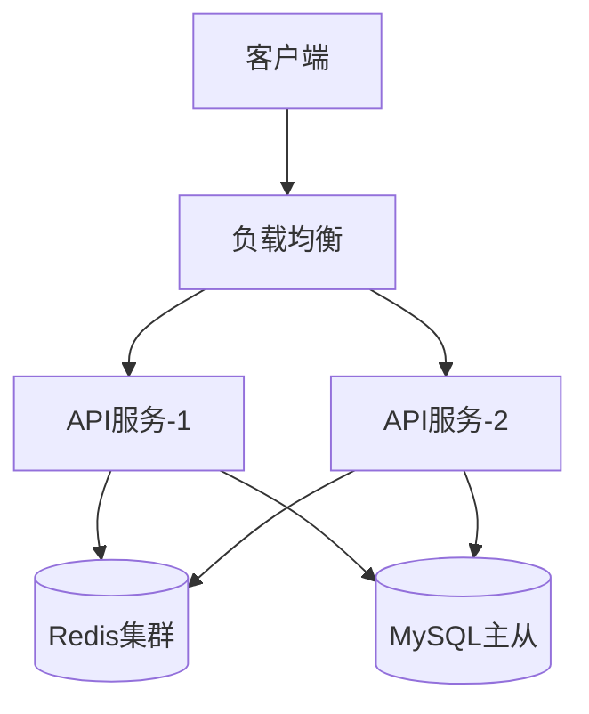

# arch-designer 参考模板

> Level 3 资源文件，包含输出文件的详细模板和示例。SKILL.md 中引用，按需读取。

---

## 零、架构类型决策树

当无法明确判断架构类型时，按以下决策树判断：

```
该系统是否有 HTTP 入口或 UI 交互？
├── 是 → 应用型（Application）
└── 否 → 该系统是否被其他代码引用？
    ├── 否（独立运行）→ 应用型（Application）
    └── 是 → 该系统是否控制调用流程（IoC）？
        ├── 是 → 框架型（Framework）
        └── 否 → 工具包型（Library）
```

判断补充依据：

| 信号 | 倾向 |
|------|------|
| 需求中有"API端点"、"页面"、"用户操作" | 应用型 |
| 需求中有"供XX调用"、"SDK"、"工具方法" | 工具包型 |
| 需求中有"扩展点"、"插件"、"生命周期" | 框架型 |
| 需求中有"注解"、"约定"、"自动发现" | 框架型 |
| 需求中有"Builder模式"、"链式调用" | 工具包型 |
| 需求中有"引擎"、"管道"、"中间件" | 框架型 |

一个项目中可能同时存在不同类型的模块。例如：
- `travel-server` 是应用型（Spring Boot Web）
- `common/parser` 是工具包型（标记解析库）
- `travel-solver` 是工具包型（OR-Tools 封装库）

---

## 一、README.md 模板

```markdown
# 架构设计：{需求名称}

## 速览卡

**核心目标**: {一句话描述架构目标}
**模块数量**: {N} 个模块
**关键决策**: {N} 个 ADR
**技术栈**: {主要技术列表}
**架构风格**: {分层/微服务/事件驱动/单体模块化}

## 模块概览

| 模块 | 职责 | 依赖 | 关键接口数 |
|------|------|------|-----------|
| AM0-{名称} | {一句话职责} | {依赖列表} | {数量} |

## 架构图

```mermaid
graph TB
    subgraph {系统名称}
        AM0[{模块名}]
        AM1[{模块名}]
    end
    AM0 -->|调用| AM1
```

## 关键决策

| ADR | 决策 | 状态 |
|-----|------|------|
| ADR-001 | {决策标题} | 已接受 |

## 下一步

- [ ] 运行 `/struct-designer <arch/路径>` 进行结构设计
- [ ] 或直接运行 `/impl-planner <breakdown/路径>` 生成执行计划
```

---

## 二、SUMMARY.md 模板

```markdown
# 架构设计总结

## 架构概览

| 模块 | 职责 | 对外能力 | 依赖 |
|------|------|---------|------|
| AM0 | ... | ... | AM1, AM2 |

## 分层模式

| 层 | 职责 | 规则 |
|----|------|------|
| 展示层 | 接收请求、参数校验、响应格式化 | 不含业务逻辑 |
| 业务层 | 核心业务逻辑、流程编排 | 不直接操作外部系统 |
| 数据层 | 数据持久化、查询 | 不含业务逻辑 |
| 基础设施层 | 外部系统集成、中间件 | 只被业务层调用 |

## 关键决策汇总

| # | 决策 | 理由 | 风险 |
|---|------|------|------|
| 1 | ... | ... | ... |

## 风险和待确认事项

- **风险1**: {描述} → {缓解措施}
- **待确认**: {问题} → {建议答案}
```

---

## 三、A01-架构总览.md 模板

```markdown
# A01 - 架构总览

## 系统上下文

{一句话描述系统的整体定位}

```mermaid
graph LR
    User[用户] --> System[{系统名称}]
    System --> ExtAPI[外部API]
    System --> DB[(数据库)]
```

## 模块划分

### AM0 - {模块名称}

- **职责**: {一句话}
- **包含功能**: 对应拆解报告中 {M0-xxx} 的功能单元
- **对外能力**:
  - {能力1}: {一句话说明}
  - {能力2}: {一句话说明}
- **依赖**: AM1, AM2

### AM1 - {模块名称}
...

## 依赖关系图

```mermaid
graph TB
    AM0[{模块名}] -->|同步调用| AM1[{模块名}]
    AM0 -->|异步消息| AM2[{模块名}]
    AM1 -->|数据访问| DB[(数据库)]
```

## 分层架构

{描述整体分层模式和各层职责}

```
┌─────────────────────────────────┐
│          展示层 (API)            │
├─────────────────────────────────┤
│          业务层 (Service)        │
├─────────────────────────────────┤
│          数据层 (Repository)     │
├─────────────────────────────────┤
│          基础设施层 (External)    │
└─────────────────────────────────┘
```
```

---

## 四、A02-接口契约.md 模板

```markdown
# A02 - 接口契约

## 概述

定义模块间的所有接口契约。每个接口包含通信方式、参数、响应和错误处理。

---

## IC-001: {接口名称}

- **调用方**: AM0 → **提供方**: AM1
- **通信方式**: HTTP REST / gRPC / 内存调用 / 消息队列
- **路径/主题**: `/api/v1/xxx` 或 `topic.xxx`

### 请求参数

| 参数名 | 类型 | 必填 | 说明 |
|--------|------|------|------|
| id | Long | 是 | 主键ID |
| name | String | 否 | 名称（最长50字符） |

### 响应结构

| 字段名 | 类型 | 说明 |
|--------|------|------|
| code | Integer | 状态码（0=成功） |
| data | Object | 业务数据 |
| data.id | Long | 主键 |
| data.name | String | 名称 |

### 错误码

| 错误码 | 说明 | 处理策略 |
|--------|------|---------|
| 404 | 资源不存在 | 提示用户 |
| 500 | 服务内部错误 | 重试/降级 |

### 性能要求

- 响应时间: P99 < 200ms
- 并发量: 支持 100 QPS

---

## IC-002: {接口名称}
...
```

---

## 五、A03-技术选型.md 模板

```markdown
# A03 - 技术选型

## 选型总览

| 领域 | 选择 | 版本 | 理由 |
|------|------|------|------|
| Web 框架 | Spring Boot | 3.x | 项目已有，团队熟悉 |
| 数据库 | MySQL | 8.x | 已有基础设施 |
| 缓存 | Redis | 7.x | 高性能，支持多种数据结构 |

## 详细说明

### 1. Web 框架

**选择**: Spring Boot 3.x
**替代方案**: Quarkus, Micronaut
**选择理由**:
- 项目已有 Spring Boot 基础设施
- 团队技术栈一致
- 生态完善，社区活跃
**代价**:
- 启动速度较慢
- 内存占用较高

### 2. 数据库
...
```

---

## 六、A04-部署架构.md 模板

```markdown
# A04 - 部署架构

## 部署拓扑



## 资源规划

| 服务 | 实例数 | CPU | 内存 | 磁盘 |
|------|--------|-----|------|------|
| API 服务 | 2 | 2C | 4G | 20G |
| 数据库 | 1主1从 | 4C | 8G | 100G |

## 部署策略

- 容器化: Docker
- 编排: Docker Compose（开发）/ Kubernetes（生产）
- CI/CD: GitHub Actions

## 环境规划

| 环境 | 用途 | 数据 |
|------|------|------|
| dev | 开发调试 | Mock 数据 |
| staging | 集成测试 | 匿名化数据 |
| prod | 生产 | 真实数据 |
```

---

## 七、ADR 模板

```markdown
# ADR-001: {决策标题}

## 状态

已接受

## 背景

{描述为什么需要做这个决策，面临的问题和约束}

## 考虑的方案

### 方案 A: {名称}
- 优点: ...
- 缺点: ...

### 方案 B: {名称}
- 优点: ...
- 缺点: ...

## 决策

选择方案 {A/B}

## 理由

{为什么选择这个方案，权衡了哪些因素}

## 后果

### 积极影响
- ...

### 消极影响/风险
- ...

### 需要关注的事项
- ...
```

---

## 八、工具包 API 模板（Library 型）

当架构类型为 Library 时，A02-接口契约.md 应使用以下模板替代应用型模板。

```markdown
# A02 - 公共 API 设计

## API 总览

| 入口类 | 用途 | 典型调用方式 |
|--------|------|-------------|
| XxxTool | 主入口 | `XxxTool.create(config).process(input)` |
| XxxBuilder | 构建配置 | `XxxTool.builder().setA().setB().build()` |

---

## API-001: {入口类名}

**类型**: 门面类（Facade）
**包**: `com.xxx.api`
**线程安全**: 是
**since**: 1.0

### 创建方式

```java
// 方式1：Builder（推荐）
XxxTool tool = XxxTool.builder()
    .setStrategy(Strategy.FAST)
    .setTimeout(Duration.ofSeconds(30))
    .build();

// 方式2：从配置创建
XxxConfig config = XxxConfig.load("config.yaml");
XxxTool tool = XxxTool.create(config);
```

### 核心方法

| 方法签名 | 说明 | 返回 | 异常 |
|---------|------|------|------|
| `Result process(Input input)` | 处理输入 | Result | XxxException |
| `List<Result> batchProcess(List<Input> inputs)` | 批量处理 | List | XxxException |
| `void close()` | 释放资源 | void | - |

### 配置项

| 配置项 | 类型 | 默认值 | 说明 |
|--------|------|--------|------|
| strategy | Strategy | FAST | 处理策略 |
| timeout | Duration | 30s | 超时时间 |
| maxRetry | int | 3 | 最大重试次数 |

---

## SPI-001: {策略接口名}

**类型**: 扩展点接口（SPI）
**包**: `com.xxx.spi`
**用途**: 用户可实现此接口来替换默认处理策略

### 接口方法

| 方法签名 | 说明 | 调用时机 |
|---------|------|---------|
| `boolean supports(Context ctx)` | 判断是否处理 | 引擎选择策略时 |
| `Result execute(Context ctx)` | 执行处理 | 引擎执行时 |
| `int priority()` | 优先级 | 策略排序时（数字越小优先级越高） |

### 内置实现

| 实现类 | 说明 | 触发条件 |
|--------|------|---------|
| FastStrategy | 快速策略（默认） | 始终可用 |
| PreciseStrategy | 精确策略 | 需要高精度结果时 |

### 注册方式

```java
// 编程式注册
XxxTool.builder()
    .addStrategy(new MyCustomStrategy())
    .build();
```

---

## Callback-001: {回调接口名}

**类型**: 回调接口（Callback）
**包**: `com.xxx.callback`

### 回调方法

| 方法签名 | 说明 | 线程安全 |
|---------|------|---------|
| `void onSuccess(Result result)` | 处理成功回调 | 是 |
| `void onError(XxxException ex)` | 处理失败回调 | 是 |
| `void onProgress(int percent)` | 进度通知 | 是 |
```

---

## 九、框架 SPI 模板（Framework 型）

当架构类型为 Framework 时，A02-接口契约.md 应使用以下模板。

```markdown
# A02 - SPI 和扩展点设计

## SPI 总览

| SPI 接口 | 扩展点 | 默认实现 | 注册方式 |
|----------|--------|---------|---------|
| Plugin | 核心处理插件 | DefaultPlugin | @XxxPlugin 注解 |
| Handler | 事件处理器 | DefaultHandler | 编程式注册 |

---

## SPI-001: Plugin 接口

**包**: `com.xxx.spi`
**生命周期**: 每次请求创建新实例 / 单例复用

### 生命周期回调

| 方法 | 调用时机 | 说明 |
|------|---------|------|
| `void onInit(Context ctx)` | 初始化 | 加载资源、读取配置 |
| `Result onProcess(Input input)` | 处理 | 核心处理逻辑 |
| `void onDestroy()` | 销毁 | 释放资源 |

### 契约约束

- `onInit` 只调用一次
- `onProcess` 可能被并发调用（需标注是否线程安全）
- `onDestroy` 在框架关闭时调用

### 注册方式

```java
// 方式1：注解声明（推荐）
@XxxPlugin(name = "my-plugin", priority = 10)
public class MyPlugin implements Plugin { ... }

// 方式2：编程式注册
Framework.bootstrap()
    .registerPlugin(new MyPlugin())
    .start();

// 方式3：配置文件
// config.yaml
plugins:
  - class: com.example.MyPlugin
    priority: 10
    config:
      key: value
```

---

## Event-001: {事件类型}

**触发方**: 框架引擎
**监听方**: 用户注册的 EventListener

### 事件数据结构

| 字段 | 类型 | 说明 |
|------|------|------|
| type | EventType | 事件类型 |
| source | String | 触发源 |
| timestamp | long | 时间戳 |
| data | Map<String, Object> | 事件数据 |

### 监听方式

```java
framework.addEventListener(EventType.PROCESS_COMPLETE, event -> {
    System.out.println("处理完成: " + event.getData());
});
```
```
