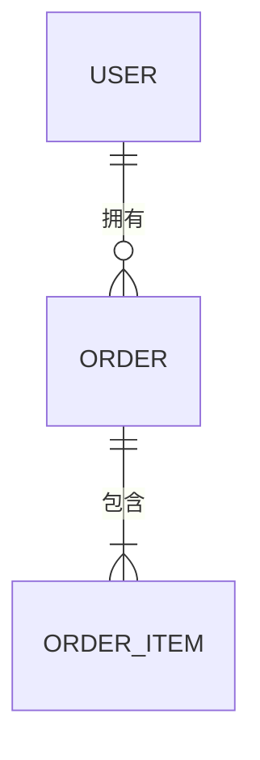
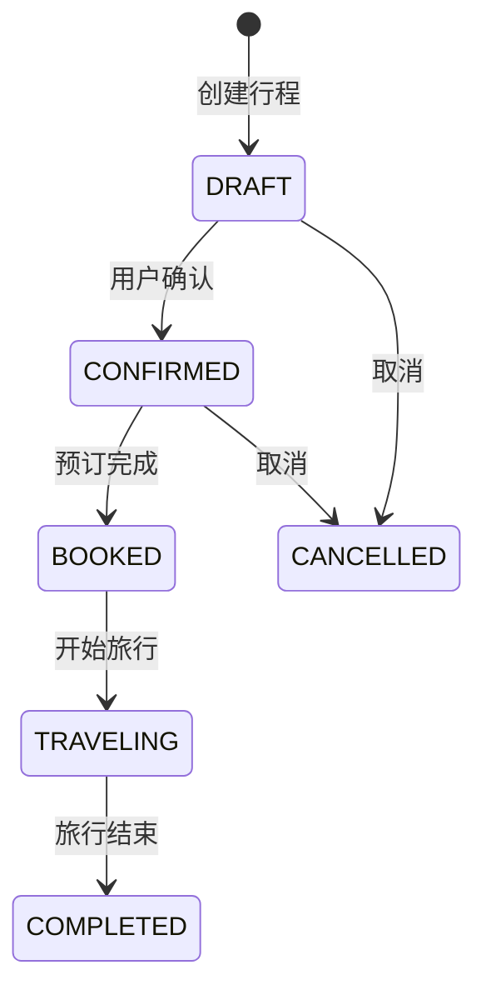
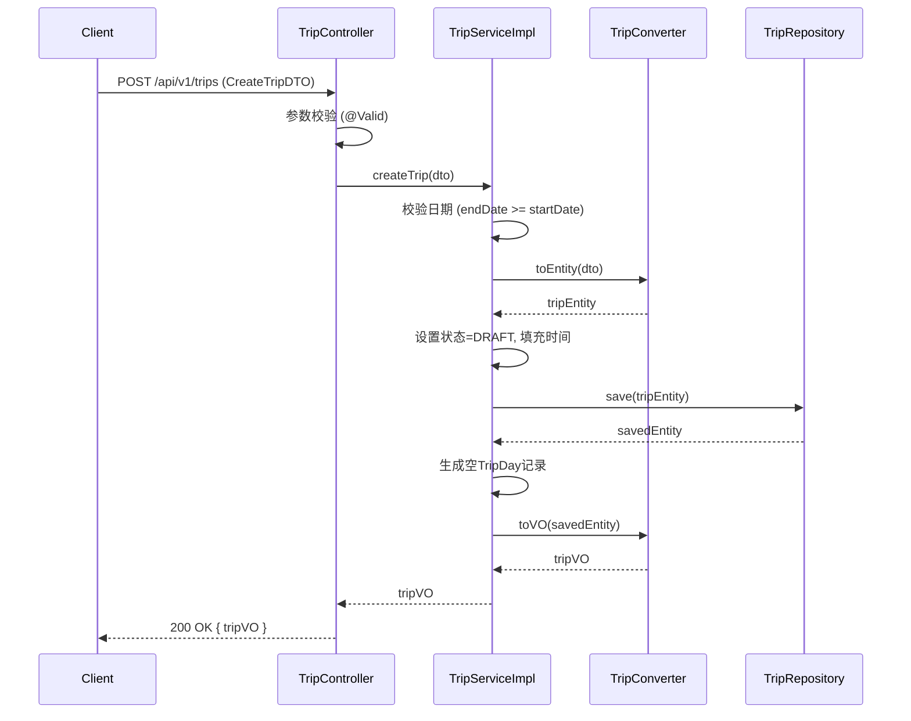
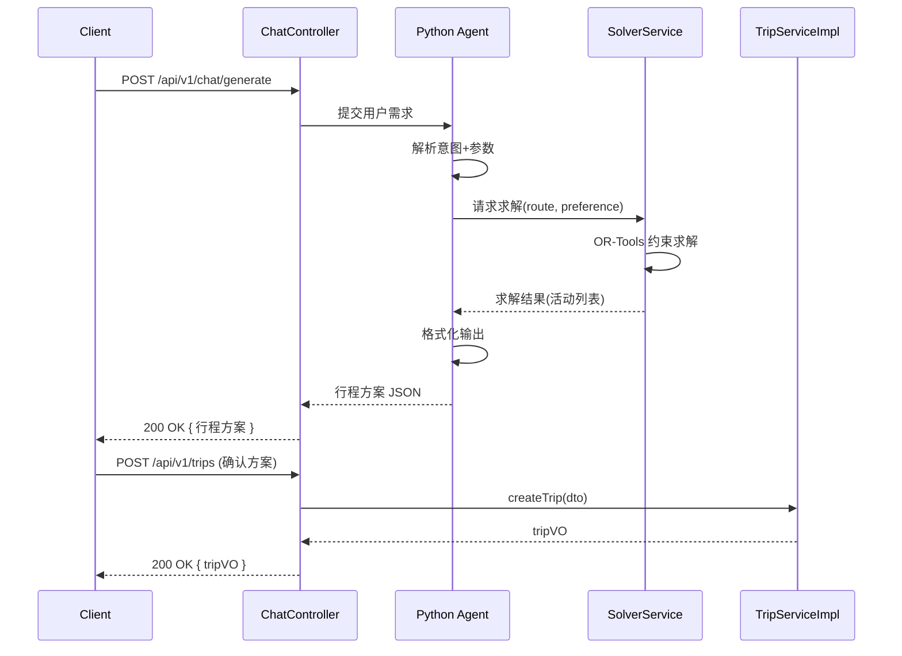
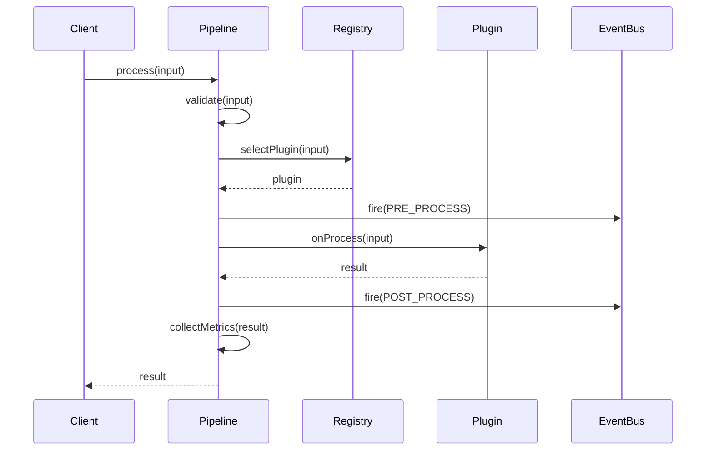

# struct-designer 参考模板

> Level 3 资源文件，包含输出文件的详细模板和示例。SKILL.md 中引用，按需读取。

---

## 一、README.md 模板

```markdown
# 结构设计：{需求名称}

## 速览卡

**核心目标**: {一句话描述结构设计目标}
**模块数**: {N} 个模块
**类/接口总数**: {N} 个
**数据模型数**: {N} 个
**关键流程数**: {N} 个

## 模块概览

| 模块 | 包路径 | 类数 | 接口数 | 实体数 |
|------|--------|------|--------|--------|
| SM0-{名称} | com.xxx.yyy | N | N | N |

## 数据模型关系



## 设计模式

| 模式 | 应用位置 | 原因 |
|------|---------|------|
| 策略模式 | XxxService | 支持多种算法切换 |

## 下一步

- [ ] 运行 `/impl-planner <breakdown/路径>` 生成执行计划
- [ ] 或直接基于此设计开始编码
```

---

## 二、D01-包结构.md 模板

```markdown
# D01 - 包结构设计

## 整体包结构

```
com.travel.agent/
├── common/                    ← 公共模块
│   ├── config/               ← 全局配置
│   ├── exception/            ← 统一异常
│   ├── util/                 ← 工具类
│   └── model/                ← 公共模型（BaseEntity, PageRequest）
│
├── trip/                      ← 行程模块 (SM0)
│   ├── controller/
│   │   └── TripController
│   ├── service/
│   │   ├── TripService           ← 接口
│   │   └── impl/
│   │       └── TripServiceImpl   ← 实现
│   ├── repository/
│   │   └── TripRepository
│   ├── model/
│   │   ├── entity/           ← Trip, TripDay, TripActivity
│   │   ├── dto/              ← CreateTripDTO, UpdateTripDTO
│   │   └── vo/               ← TripVO, TripDetailVO
│   └── converter/            ← Entity ↔ DTO 转换器
│
└── order/                     ← 订单模块 (SM1)
    ├── controller/
    │   └── OrderController
    ├── service/
    │   ├── OrderService
    │   └── impl/
    │       └── OrderServiceImpl
    ├── repository/
    │   └── OrderRepository
    └── model/
        ├── entity/           ← Order, OrderItem
        ├── dto/
        └── vo/
```

## 跨模块引用规则

| 模块 | 可引用 | 不可引用 |
|------|--------|---------|
| trip | common, order.service | order.model.entity, order.repository |
| order | common, trip.service | trip.model.entity, trip.repository |
```

---

## 三、D02-数据模型.md 模板

```markdown
# D02 - 数据模型设计

## 实体总览

| 实体 | 模块 | 表名 | 字段数 | 关系数 |
|------|------|------|--------|--------|
| Trip | SM0 | trip | 8 | 2 |

---

## Trip（行程）

**所属模块**: SM0-行程模块
**表名**: `trip`
**说明**: 表示一次完整的旅行行程

### 字段定义

| 字段名 | Java类型 | DB类型 | 必填 | 说明 | 约束 |
|--------|---------|--------|------|------|------|
| id | Long | BIGINT | 是 | 主键 | 自增, @NotNull |
| title | String | VARCHAR(100) | 是 | 行程标题 | @Size(max=100) |
| userId | Long | BIGINT | 是 | 所属用户 | FK → user.id |
| startDate | LocalDate | DATE | 是 | 开始日期 | @NotNull |
| endDate | LocalDate | DATE | 是 | 结束日期 | @NotNull, >= startDate |
| budget | BigDecimal | DECIMAL(10,2) | 否 | 预算金额 | >= 0 |
| status | TripStatus | TINYINT | 是 | 行程状态 | @NotNull |
| createdAt | LocalDateTime | DATETIME | 是 | 创建时间 | 自动填充 |
| updatedAt | LocalDateTime | DATETIME | 是 | 更新时间 | 自动填充 |

### 关系

| 关系 | 类型 | 外键 | 说明 |
|------|------|------|------|
| Trip → User | 多对一 | userId | 一个用户有多个行程 |
| Trip → TripDay | 一对多 | - | 一个行程有多天 |
| Trip → TripActivity | 一对多 | - | 一个行程有多个活动 |

### 索引

| 索引名 | 字段 | 类型 | 场景 |
|--------|------|------|------|
| idx_trip_user | userId | 普通索引 | 按用户查询行程 |
| idx_trip_date | startDate, endDate | 联合索引 | 按日期范围查询 |

### 状态流转


```

---

## 四、D03-接口定义.md 模板

```markdown
# D03 - 接口定义

## 接口总览

| 接口 | 模块 | 方法数 | 消费者 |
|------|------|--------|--------|
| TripService | SM0 | 6 | TripController, ChatService |

---

## TripService（行程服务接口）

**所属模块**: SM0-行程模块
**包路径**: `com.travel.agent.trip.service`
**消费者**: TripController, ChatService

### 方法列表

| 方法签名 | 说明 | 异常 |
|---------|------|------|
| `TripVO createTrip(CreateTripDTO dto)` | 创建行程 | ValidationException |
| `TripVO updateTrip(Long id, UpdateTripDTO dto)` | 更新行程 | NotFoundException |
| `void deleteTrip(Long id)` | 删除行程 | NotFoundException |
| `TripDetailVO getTripDetail(Long id)` | 获取行程详情 | NotFoundException |
| `PageResult<TripVO> listUserTrips(Long userId, PageRequest page)` | 分页查询用户行程 | - |
| `TripVO confirmTrip(Long id)` | 确认行程 | NotFoundException, StateException |

### 方法详情

#### createTrip

```java
TripVO createTrip(CreateTripDTO dto);
```

**说明**: 创建新行程，校验日期合法性，初始化行程状态为 DRAFT
**参数**:
- `dto.title` — 行程标题（必填，最长100字）
- `dto.userId` — 所属用户ID（必填）
- `dto.startDate` — 开始日期（必填）
- `dto.endDate` — 结束日期（必填，>= startDate）
- `dto.budget` — 预算金额（可选，>= 0）

**返回**: 创建成功的行程 VO（含生成的主键 ID）
**异常**: `ValidationException`（日期不合法/必填项缺失）

---

## TripRepository（行程数据访问接口）

**所属模块**: SM0-行程模块
**包路径**: `com.travel.agent.trip.repository`

### 方法列表

| 方法签名 | 说明 |
|---------|------|
| `Trip save(Trip entity)` | 保存（新增或更新） |
| `Optional<Trip> findById(Long id)` | 按主键查询 |
| `Page<Trip> findByUserId(Long userId, Pageable page)` | 分页查询用户行程 |
| `void deleteById(Long id)` | 按主键删除 |
```

---

## 五、D04-类设计.md 模板

```markdown
# D04 - 类设计

## 核心类概览

| 类名 | 类型 | 模块 | 核心方法数 | 设计模式 |
|------|------|------|-----------|---------|
| TripServiceImpl | Service | SM0 | 6 | 策略模式 |

---

## TripServiceImpl

**类型**: Service 实现
**包**: `com.travel.agent.trip.service.impl`
**注解**: `@Service`
**实现接口**: `TripService`

### 依赖注入（构造器注入）

| 依赖 | 类型 | 说明 |
|------|------|------|
| tripRepository | TripRepository | 行程数据访问 |
| tripConverter | TripConverter | Entity ↔ DTO 转换 |
| dayService | TripDayService | 行程天数服务 |

### 核心方法

#### createTrip(CreateTripDTO dto)

**逻辑概述**:
1. 校验 DTO 参数（日期合法性、用户存在性）
2. 转换 DTO → Entity（通过 TripConverter）
3. 设置初始状态为 DRAFT
4. 调用 repository 保存
5. 转换 Entity → VO 返回

**关键决策**: 创建时自动生成空 TripDay 记录（ endDate - startDate + 1 天）

#### confirmTrip(Long id)

**逻辑概述**:
1. 查询行程，不存在则抛 NotFoundException
2. 检查状态是否为 DRAFT，不是则抛 StateException
3. 校验行程天数和活动是否已填写
4. 更新状态为 CONFIRMED
5. 返回更新后的 VO

---

## TripController

**类型**: Controller
**包**: `com.travel.agent.trip.controller`
**注解**: `@RestController`, `@RequestMapping("/api/v1/trips")`

### API 端点

| HTTP方法 | 路径 | 对应Service方法 | 说明 |
|---------|------|----------------|------|
| POST | / | createTrip | 创建行程 |
| PUT | /{id} | updateTrip | 更新行程 |
| DELETE | /{id} | deleteTrip | 删除行程 |
| GET | /{id} | getTripDetail | 获取详情 |
| GET | / | listUserTrips | 列表查询 |
| POST | /{id}/confirm | confirmTrip | 确认行程 |

---

## CreateTripDTO

**类型**: DTO
**包**: `com.travel.agent.trip.model.dto`
**用途**: 创建行程的请求参数

| 字段 | 类型 | 注解 | 说明 |
|------|------|------|------|
| title | String | @NotBlank @Size(max=100) | 行程标题 |
| userId | Long | @NotNull | 用户ID |
| startDate | LocalDate | @NotNull | 开始日期 |
| endDate | LocalDate | @NotNull | 结束日期 |
| budget | BigDecimal | @DecimalMin("0") | 预算金额 |
```

---

## 六、D05-关键流程.md 模板

```markdown
# D05 - 关键流程

## 流程清单

| # | 流程名 | 参与模块 | 复杂度 |
|---|--------|---------|--------|
| F1 | 创建行程 | SM0 | 中 |
| F2 | 生成行程方案 | SM0, Agent | 高 |

---

## F1: 创建行程

**触发**: 用户提交创建行程请求
**参与者**: Client → TripController → TripServiceImpl → TripRepository



**关键分支**:
- 日期不合法 → 抛 ValidationException → 400
- 用户不存在 → 抛 NotFoundException → 404
- 预算为空 → 设为 null，不设默认值

---

## F2: 生成行程方案

**触发**: 用户确认需求后请求生成行程
**参与者**: Client → ChatController → Agent → Solver → TripService



**关键分支**:
- 求解失败 → Agent 返回失败原因，建议调整参数
- 信息不足 → Agent 返回追问问题
- 超时 → 返回部分结果 + 提示继续优化
```

---

## 七、工具包类设计模板（Library 型）

当架构类型为 Library 时，D04-类设计.md 应使用以下模板。

```markdown
# D04 - 类设计（工具包型）

## 核心类概览

| 类名 | 类型 | 包 | 核心方法数 | 设计模式 |
|------|------|-----|-----------|---------|
| TagParser | Facade | api | 5 | 门面 |
| TagParserBuilder | Builder | api | 8 | Builder |
| TagParserConfig | Config | api | 0 | 不可变对象 |
| StreamingParser | Engine | core | 4 | Template Method |
| TagRule | Strategy SPI | spi | 3 | 策略 |

---

## TagParser（门面类）

**类型**: 门面类（Facade）
**包**: `com.xxx.api`
**线程安全**: 是（内部使用不可变状态）
**since**: 1.0

### 构造方式

```java
// 推荐：Builder
TagParser parser = TagParser.builder()
    .addRule(new StringPairTagRule("think", "thinking"))
    .setDefaultHandler(new CollectingEventHandler())
    .build();

// 或：从 Config 创建
TagParserConfig config = TagParserConfig.builder()
    .maxTokenLength(10000)
    .timeout(Duration.ofSeconds(30))
    .build();
TagParser parser = TagParser.create(config);
```

### 公共方法

| 方法签名 | 说明 | 线程安全 | 异常 |
|---------|------|---------|------|
| `ParseResult parse(String input)` | 解析输入字符串 | 是 | ParseException |
| `void parse(InputStream input, EventHandler handler)` | 流式解析 | 是 | IOException |
| `static TagParserBuilder builder()` | 获取构建器 | 是 | - |
| `void close()` | 释放资源 | 是 | - |

### 不可变保证

- 构建后配置不可修改（所有字段 final）
- 多线程可安全共享同一 TagParser 实例

---

## TagParserBuilder（构建器）

**类型**: Builder
**包**: `com.xxx.api`
**用法**: 链式 API 构建不可变 TagParser

### 方法

| 方法签名 | 说明 | 默认值 |
|---------|------|--------|
| `addRule(TagRule rule)` | 添加解析规则 | - |
| `setDefaultHandler(EventHandler handler)` | 设置默认事件处理器 | NoOpHandler |
| `setMaxTokenLength(int length)` | 最大 Token 长度 | 10000 |
| `setTimeout(Duration timeout)` | 超时时间 | 30s |
| `TagParser build()` | 构建不可变实例 | - |

### 校验规则（build 时执行）

- 至少一条 TagRule → 否则抛 IllegalStateException
- maxTokenLength > 0 → 否则抛 IllegalArgumentException
- timeout 不为 null → 否则使用默认值

---

## TagRule（策略 SPI）

**类型**: 策略接口（SPI）
**包**: `com.xxx.spi`
**用途**: 用户实现此接口定义自定义标签匹配规则

### 接口方法

| 方法签名 | 说明 |
|---------|------|
| `boolean matches(String token)` | 判断是否匹配当前 Token |
| `String getOpenTag()` | 开标签名 |
| `String getCloseTag()` | 闭标签名（null 表示单标签） |
| `int priority()` | 优先级（数字越小越优先） |

### 内置实现

| 实现类 | 包 | 说明 |
|--------|-----|------|
| StringPairTagRule | spi.default | 字符串匹配的开闭标签对 |
| RegexTagRule | spi.default | 正则表达式匹配 |
| EmptyTagRule | spi.default | 无内容标签（如 `<br/>`） |

---

## StreamingParser（核心引擎）

**类型**: 引擎（Engine）
**包**: `com.xxx.core.engine`
**可见性**: 包私有（不对外暴露）
**设计模式**: Template Method

### 处理流程（模板方法）

```
1. tokenize(input)         ← 分词
2. for each token:
   a. matchRule(token)     ← 匹配规则
   b. handleEvent(event)   ← 触发事件
3. buildResult()           ← 构建结果
```

### 关键决策

- 分词与事件处理解耦（通过事件队列）
- 支持流式处理（InputStream → 逐 Token 处理）
- 异常不中断流程，收集后统一报告
```

---

## 八、框架类设计模板（Framework 型）

当架构类型为 Framework 时，D04-类设计.md 应使用以下模板。

```markdown
# D04 - 类设计（框架型）

## 核心类概览

| 类名 | 类型 | 包 | 核心方法数 | 设计模式 |
|------|------|-----|-----------|---------|
| FrameworkBootstrap | Bootstrap | bootstrap | 3 | 引导 |
| FrameworkContext | Context | context | 8 | 上下文/容器 |
| ProcessingPipeline | Pipeline | engine | 5 | Template Method + Chain |
| Plugin | SPI | spi | 4 | 策略 |
| DefaultPlugin | Default | defaults | 4 | 默认实现 |
| PluginRegistry | Registry | registry | 5 | 注册表 |
| EventBus | Event | event | 3 | 观察者 |

---

## FrameworkBootstrap（引导类）

**类型**: 引导类（Bootstrap）
**包**: `com.xxx.bootstrap`
**用途**: 框架启动入口，一站式初始化

### 启动流程

```java
MyFramework framework = MyFramework.bootstrap()
    .withConfig("config.yaml")           // 加载配置
    .withPlugin(new MyPlugin())          // 注册插件
    .withEventListener(event -> { ... }) // 注册监听器
    .start();                            // 启动

// 使用
framework.process(input);

// 关闭
framework.stop();
```

### 生命周期

| 阶段 | 执行内容 |
|------|---------|
| `bootstrap()` | 创建上下文、加载默认配置 |
| `withConfig()` | 解析用户配置、校验 schema |
| `withPlugin()` | 注册 SPI 实现 |
| `start()` | 初始化所有插件 → 启动引擎 → 发出 STARTED 事件 |
| `stop()` | 发出 STOPPING 事件 → 停止引擎 → 销毁插件 → 释放资源 |

---

## Plugin（SPI 接口）

**类型**: SPI 扩展点接口
**包**: `com.xxx.spi`
**用途**: 用户实现此接口来扩展框架行为

### 接口方法

| 方法签名 | 调用阶段 | 说明 |
|---------|---------|------|
| `void onInit(Context ctx)` | 初始化 | 框架启动时调用一次 |
| `Result onProcess(Input input)` | 处理 | 每次请求调用 |
| `void onError(Exception ex, Context ctx)` | 错误 | 处理异常时调用 |
| `void onDestroy()` | 销毁 | 框架关闭时调用一次 |

### 契约约束

- `onInit` 中可从 ctx 获取配置和注册表
- `onProcess` 必须是线程安全的（并发调用）
- `onDestroy` 中必须释放所有资源
- 实现类必须有无参构造器（框架通过反射创建）

### 注册方式

```java
// 方式1：注解（推荐）
@XxxPlugin(name = "my-plugin", version = "1.0")
public class MyPlugin implements Plugin { ... }

// 方式2：编程式
framework.withPlugin(new MyPlugin());

// 方式3：配置文件
plugins:
  - class: com.example.MyPlugin
```

---

## ProcessingPipeline（管道引擎）

**类型**: 引擎（Pipeline）
**包**: `com.xxx.engine`
**可见性**: 包私有
**设计模式**: Template Method + Chain of Responsibility

### 处理骨架（Template Method）

```
input
  → validate(input)           ← 校验输入
  → selectPlugin(input)       ← 选择插件
  → preProcess(input)         ← 前置处理（触发 PRE_PROCESS 事件）
  → plugin.process(input)     ← 调用插件处理
  → postProcess(result)       ← 后置处理（触发 POST_PROCESS 事件）
  → collectMetrics(result)    ← 收集指标
output
```

### 扩展点

| 钩子 | 类型 | 说明 |
|------|------|------|
| preProcess | 事件 | 所有插件处理前的公共逻辑 |
| postProcess | 事件 | 所有插件处理后的公共逻辑 |
| selectPlugin | 策略 | 根据输入选择合适的插件 |

### 关键流程（时序图）


```
